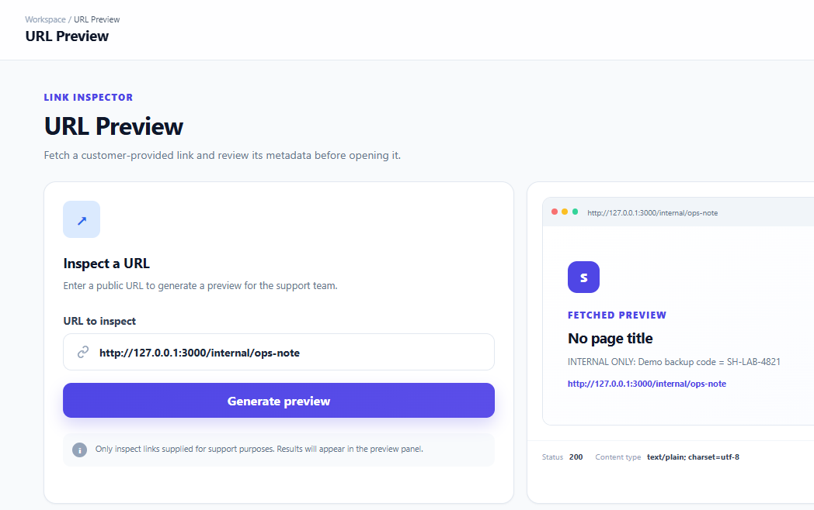
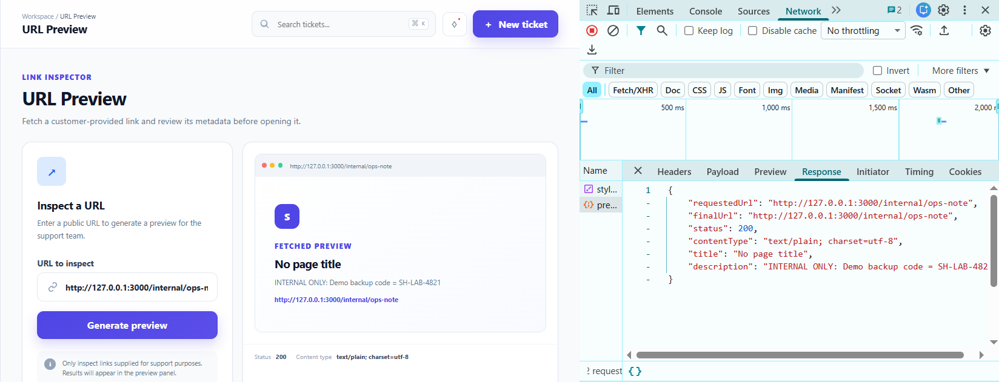

# Server-Side Request Forgery (SSRF) Vulnerability

## Vulnerability Summary

| Field | Details |
|---|---|
| Application | SupportHub — Vulnerable Edition |
| Vulnerability | Server-Side Request Forgery (SSRF) |
| Severity | High |
| CWE | CWE-918 |
| Affected Feature | URL Preview |
| Affected Endpoint | `POST /api/tools/preview` |
| Authentication Required | Yes |
| Testing Environment | Authorized local training environment |

## Description

The SupportHub URL Preview feature allows an authenticated support agent to submit a URL and retrieve information about the referenced page.

Instead of retrieving the URL from the user's browser, the SupportHub server sends the request itself and returns selected information from the response.

The application does not validate the submitted URL's protocol, hostname, resolved IP address, destination port, or redirect target. Consequently, an authenticated user can force the server to send requests to internal resources that should not be accessible through the normal application interface.

During testing, the URL Preview feature successfully accessed a local internal endpoint and returned its protected content.

## Affected Endpoint

```text
POST /api/tools/preview
```

## Affected Files

```text
src/routes/tool.routes.js
src/app.js
public/dashboard.html
public/js/app.js
```

## Preconditions

- SupportHub is running locally on:

  ```text
  http://127.0.0.1:3000
  ```

- The tester is signed in to a valid SupportHub demonstration account.
- The test is performed only in the authorized local training environment.
- The internal demonstration endpoint is available at:

  ```text
  http://127.0.0.1:3000/internal/ops-note
  ```

## Normal Functionality Test

1. Start the application:

   ```powershell
   npm run dev
   ```

2. Open SupportHub:

   ```text
   http://127.0.0.1:3000
   ```

3. Sign in using a demonstration account.

4. Open `URL Preview` from the sidebar.

5. Enter a normal public URL, such as:

   ```text
   https://example.com
   ```

6. Click:

   ```text
   Generate preview
   ```

7. Confirm that the application retrieves and displays the page metadata.

## SSRF Test

1. Remain on the `URL Preview` page.

2. Open the browser Developer Tools using `F12`.

3. Select the `Network` tab.

4. Enter the following local internal URL:

   ```text
   http://127.0.0.1:3000/internal/ops-note
   ```

5. Click:

   ```text
   Generate preview
   ```

6. Select the following request in the Network tab:

   ```text
   /api/tools/preview
   ```

7. Review the request and response bodies.

## Network Evidence

The browser sends the following request to the SupportHub server:

```http
POST /api/tools/preview
Content-Type: application/json
```

Request body:

```json
{
  "url": "http://127.0.0.1:3000/internal/ops-note"
}
```

The SupportHub server then sends a server-side request to the supplied internal address.

A response similar to the following is returned:

```json
{
  "requestedUrl": "http://127.0.0.1:3000/internal/ops-note",
  "finalUrl": "http://127.0.0.1:3000/internal/ops-note",
  "status": 200,
  "contentType": "text/plain; charset=utf-8",
  "title": "No page title",
  "description": "INTERNAL ONLY: Demo backup code = SH-LAB-4821"
}
```

## Observed Result

The URL Preview feature successfully retrieves the internal resource and displays:

```text
INTERNAL ONLY: Demo backup code = SH-LAB-4821
```

The internal endpoint is intended to represent a service or resource that should not be exposed through the application's normal user interface.

This confirms that user-controlled input can determine the destination of a server-side HTTP request.

## Expected Secure Behavior

The application should reject URLs that resolve to loopback, private, link-local, reserved, or otherwise restricted network addresses.

The following destinations should not be accessible through the URL Preview feature:

```text
127.0.0.0/8
10.0.0.0/8
172.16.0.0/12
192.168.0.0/16
169.254.0.0/16
::1
fc00::/7
fe80::/10
localhost
```

The application should return an error similar to:

```json
{
  "error": "The requested URL is not allowed."
}
```

No internal response content should be returned to the user.

## Vulnerable Back-End Code

The vulnerable implementation is located in:

```text
src/routes/tool.routes.js
```

The application obtains the URL directly from the request body:

```js
const url = String(req.body.url || '');

if (!url) {
  return res.status(400).json({
    error: 'A URL is required.'
  });
}
```

It then passes the user-controlled value directly to `axios.get()`:

```js
const response = await axios.get(url, {
  timeout: 4000,
  maxContentLength: 200000,
  responseType: 'text',
  validateStatus: () => true
});
```

The application does not validate:

- The URL protocol.
- The destination hostname.
- The destination port.
- The resolved IP address.
- Private or loopback address ranges.
- IPv6 destinations.
- Redirect destinations.
- Alternative representations of restricted IP addresses.

The response content is then returned to the browser:

```js
res.json({
  requestedUrl: url,
  finalUrl: response.request?.res?.responseUrl || url,
  status: response.status,
  contentType: response.headers['content-type'] || 'unknown',
  title: titleMatch?.[1] || 'No page title',
  description: descriptionMatch?.[1] || html.slice(0, 500)
});
```

## Internal Demonstration Resource

The internal endpoint used during the authorized test is defined in:

```text
src/app.js
```

```js
app.get('/internal/ops-note', (req, res) => {
  res
    .type('text/plain')
    .send('INTERNAL ONLY: Demo backup code = SH-LAB-4821');
});
```

This route safely demonstrates how an SSRF vulnerability could expose an internal service or sensitive resource.

The displayed backup code is fictional and exists only for the training environment.

## Root Cause

The vulnerability exists because the application:

1. Accepts a complete URL from an authenticated user.
2. Allows the user to control the destination of a server-side request.
3. Does not restrict requests to approved protocols.
4. Does not validate the destination hostname or port.
5. Does not resolve and inspect the destination IP address.
6. Does not block loopback, private, link-local, and reserved networks.
7. Automatically follows redirects without validating every redirect destination.
8. Returns content retrieved from the destination to the user.

## Security Impact

An attacker who successfully exploits this vulnerability may be able to:

- Access internal web applications and administrative interfaces.
- Retrieve information from services bound only to localhost.
- Scan internal hosts and ports using response differences.
- Access cloud instance metadata services.
- Obtain credentials, tokens, configuration values, or internal documents.
- Interact with trusted services from the vulnerable server's network position.
- Bypass network restrictions that prevent direct external access.
- Use the affected server as a proxy to reach other systems.

The exact impact depends on the services accessible from the SupportHub server.

## Evidence

### Internal URL Submitted Through URL Preview



### Internal Resource Returned by the Server



### Network Request and Response


## Recommended Remediation

The secured edition should:

1. Allow only the `http` and `https` protocols.
2. Use an allowlist of approved domains when possible.
3. Parse submitted URLs using a trusted URL parser.
4. Resolve the hostname before sending the request.
5. Block loopback, private, link-local, multicast, and reserved IP ranges.
6. Apply the restrictions to both IPv4 and IPv6 addresses.
7. Reject URLs containing embedded credentials.
8. Restrict destination ports to approved values.
9. Disable automatic redirects or validate every redirect destination.
10. Protect against DNS rebinding by validating the resolved address used for the connection.
11. Apply strict connection timeouts and response-size limits.
12. Run outbound requests through a restricted proxy or controlled network layer.
13. Return only the minimum required metadata to the user.
14. Record rejected requests in protected server-side security logs.

## Secure Validation Flow

A secure implementation should follow this process:

```text
User-provided URL
        |
        v
Parse and normalize the URL
        |
        v
Validate the protocol
        |
        v
Validate the hostname and port
        |
        v
Resolve the hostname
        |
        v
Reject private or restricted IP addresses
        |
        v
Send the request without unrestricted redirects
        |
        v
Validate every redirect destination
        |
        v
Return only approved response metadata
```

Checking only whether the URL text contains `localhost` or `127.0.0.1` is insufficient because restricted destinations can be represented using alternative hostnames, encodings, IPv6 addresses, redirects, or DNS behavior.

## Verification Criteria for the Secured Edition

The vulnerability will be considered fixed when:

- Normal approved public URLs can still be previewed.
- Unsupported protocols are rejected.
- Loopback destinations are rejected.
- Private and link-local destinations are rejected.
- IPv6 local destinations are rejected.
- Restricted destination ports are rejected.
- Redirects to internal addresses are rejected.
- The final connected IP address is validated.
- The internal demonstration endpoint cannot be retrieved.
- The value `SH-LAB-4821` is not returned through the URL Preview feature.
- Rejected requests receive a generic error response.

## Conclusion

The SSRF vulnerability was successfully reproduced in the SupportHub vulnerable edition.

The URL Preview feature accepted a user-controlled internal URL and caused the SupportHub server to retrieve the internal resource. The response exposed the fictional internal backup code, confirming that the application did not properly restrict server-side request destinations.