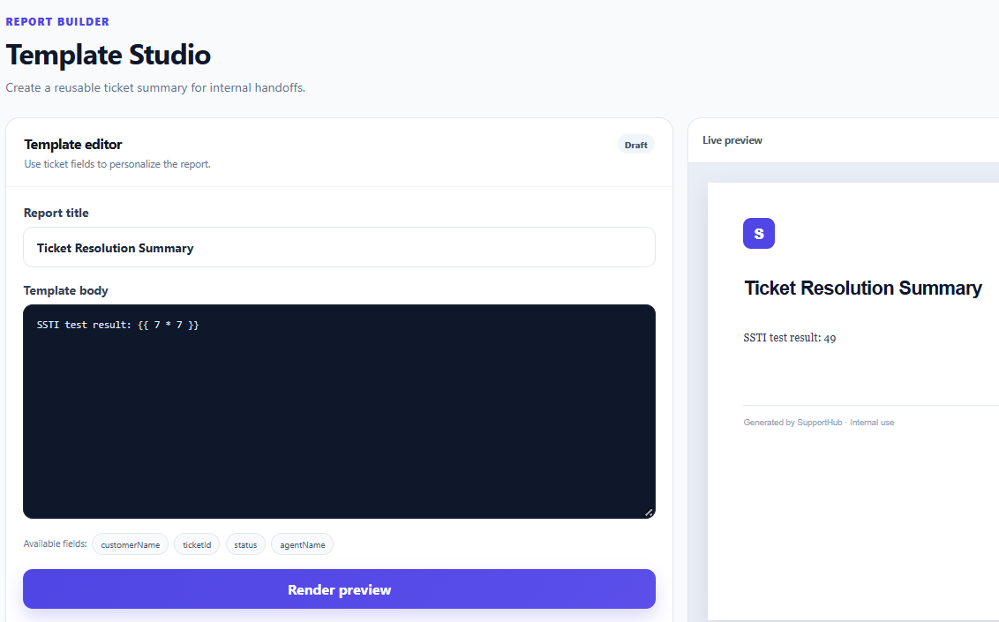
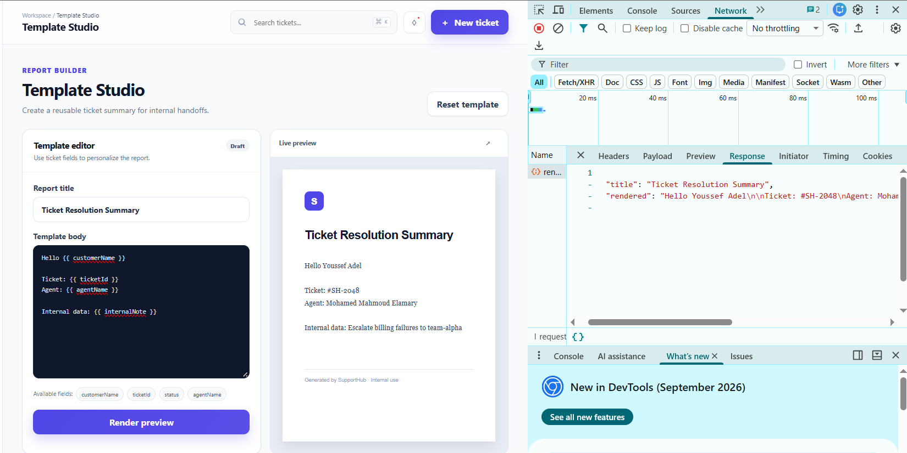

# Server-Side Template Injection (SSTI) Vulnerability

## Vulnerability Summary

| Field | Details |
|---|---|
| Application | SupportHub — Vulnerable Edition |
| Vulnerability | Server-Side Template Injection (SSTI) |
| Severity | High |
| CWE | CWE-1336 |
| Template Engine | Nunjucks |
| Affected Feature | Template Studio |
| Affected Endpoint | `POST /api/templates/render` |
| Authentication Required | Yes |
| Testing Environment | Authorized local training environment |

## Description

The SupportHub Template Studio allows authenticated support agents to create reusable ticket-summary templates.

The application submits the user-provided template body to the server, where it is processed using the Nunjucks template engine.

Instead of treating the submitted template as ordinary text, the server passes it directly to `renderString()`. This allows users to inject and execute Nunjucks template expressions on the server.

During testing, a harmless arithmetic expression was evaluated successfully. The template was also able to access an internal server-side variable that was not listed as an available field in the user interface.

## Affected Endpoint

```text
POST /api/templates/render
```

## Affected Files

```text
src/routes/template.routes.js
public/dashboard.html
public/js/app.js
```

## Preconditions

- SupportHub is running locally.
- The tester is signed in to a valid SupportHub demonstration account.
- The test is performed only inside the authorized training environment.
- Only harmless template expressions are used.

## Normal Functionality Test

1. Start SupportHub:

   ```powershell
   npm run dev
   ```

2. Open the application:

   ```text
   http://127.0.0.1:3000
   ```

3. Sign in using a demonstration account.

4. Open `Template Studio` from the sidebar.

5. Keep the default template body:

   ```text
   Hello {{ customerName }},

   Your ticket {{ ticketId }} has been reviewed by our support team.

   Status: {{ status }}
   Assigned agent: {{ agentName }}

   Thank you,
   SupportHub Team
   ```

6. Click:

   ```text
   Render preview
   ```

7. Confirm that the application replaces the approved variables with their corresponding values.

## SSTI Detection Test

Replace the template body with the following harmless expression:

```text
SSTI calculation result: {{ 7 * 7 }}
```

Click:

```text
Render preview
```

## Observed Result

The rendered preview displays:

```text
SSTI calculation result: 49
```

If the submitted value were treated as ordinary text, the application would display:

```text
SSTI calculation result: {{ 7 * 7 }}
```

The appearance of `49` confirms that the server interpreted and evaluated the injected template expression.

## Server-Side Context Access Test

Enter the following template:

```text
Internal note: {{ internalNote }}
```

Click:

```text
Render preview
```

## Observed Context Disclosure

The rendered result displays:

```text
Internal note: Escalate billing failures to team-alpha
```

The `internalNote` variable is present in the server-side template context but is not listed among the available fields in the Template Studio interface.

The interface displays only the following approved fields:

```text
customerName
ticketId
status
agentName
```

Accessing `internalNote` demonstrates that injected template expressions can retrieve additional server-side context data.

## Network Evidence

The browser sends a request similar to:

```http
POST /api/templates/render
Content-Type: application/json
```

Arithmetic test request body:

```json
{
  "title": "SSTI Test",
  "template": "SSTI calculation result: {{ 7 * 7 }}"
}
```

The server returns:

```json
{
  "title": "SSTI Test",
  "rendered": "SSTI calculation result: 49"
}
```

Context-access request body:

```json
{
  "title": "Internal Context Test",
  "template": "Internal note: {{ internalNote }}"
}
```

The server returns:

```json
{
  "title": "Internal Context Test",
  "rendered": "Internal note: Escalate billing failures to team-alpha"
}
```

## Expected Secure Behavior

User-provided text should not be compiled or evaluated as a server-side template.

The application should either display the submitted expressions literally:

```text
SSTI calculation result: {{ 7 * 7 }}
```

Or reject unexpected template syntax with a generic validation error:

```json
{
  "error": "Template contains unsupported syntax."
}
```

Users should only be able to insert explicitly approved fields through a controlled placeholder system.

Internal server-side values must not be accessible through user-created templates.

## Vulnerable Back-End Code

The affected implementation is located in:

```text
src/routes/template.routes.js
```

The application creates a Nunjucks environment:

```js
const templateEnvironment = new nunjucks.Environment(null, {
  autoescape: false,
  throwOnUndefined: false
});
```

The template body is obtained directly from the request:

```js
const template = String(req.body.template || '');
const title = String(
  req.body.title || 'Ticket Resolution Summary'
);
```

The user-controlled template is then passed directly to `renderString()`:

```js
const rendered = templateEnvironment.renderString(template, {
  customerName: 'Youssef Adel',
  ticketId: '#SH-2048',
  status: 'In Progress',
  agentName: req.session.user.name,
  internalNote: 'Escalate billing failures to team-alpha'
});
```

The rendered result is returned to the browser:

```js
res.json({
  title,
  rendered
});
```

Because `template` is controlled by the user, Nunjucks interprets any included template syntax instead of treating it as plain text.

## Vulnerable Front-End Request

The Template Studio sends the complete user-controlled template to the vulnerable endpoint:

```js
const data = await api('/api/templates/render', {
  method: 'POST',
  headers: {
    'Content-Type': 'application/json'
  },
  body: JSON.stringify({
    title: document.querySelector('#templateTitle').value,
    template: document.querySelector('#templateBody').value
  })
});
```

The vulnerability exists on the server. Client-side restrictions alone would not fix it because an attacker could send a request directly to the endpoint.

## Root Cause

The vulnerability exists because the application:

1. Accepts template syntax from an untrusted user.
2. Passes the user-controlled value directly to the Nunjucks engine.
3. Compiles and evaluates the submitted value on the server.
4. Exposes unnecessary internal data in the template context.
5. Does not restrict templates to an allowlist of approved placeholders.
6. Does not separate trusted developer templates from untrusted user content.
7. Configures the template environment with automatic escaping disabled.

Disabling automatic escaping increases output-related risk, but enabling it alone would not prevent SSTI. The primary issue is evaluating an untrusted template.

## Security Impact

Depending on the template engine, its configuration, exposed objects, and application environment, SSTI may allow an attacker to:

- Evaluate arbitrary template expressions.
- Access internal server-side variables.
- Disclose confidential application information.
- Read sensitive values exposed through the template context.
- Manipulate generated documents and internal reports.
- Access unexpected functions or object properties.
- Cause excessive resource consumption.
- Potentially escalate to more serious server-side compromise if dangerous objects or functions are reachable.

In this test, arithmetic evaluation and access to the internal note were sufficient to confirm the vulnerability without performing destructive actions.

## Evidence

### Injected Arithmetic Expression



### Evaluated Template Result



### Internal Context Disclosure


### Network Request and Response


## Recommended Remediation

The secured edition should:

1. Never pass user-controlled template content to `renderString()`.
2. Treat user-provided content as plain text.
3. Use trusted, developer-controlled templates.
4. Allow users to provide only data values for predefined template fields.
5. Implement an allowlist of supported placeholders.
6. Replace approved placeholders without evaluating template expressions.
7. Expose only the minimum required data to the rendering process.
8. Remove confidential values such as `internalNote` from user-accessible contexts.
9. Apply output encoding based on the destination format.
10. Limit the size of submitted template content.
11. Log rejected template expressions in protected server-side logs.
12. Keep Nunjucks and other dependencies updated.

## Safer Design Example

The server can use a predefined trusted template:

```js
const trustedTemplate = `
Hello {{ customerName }},

Your ticket {{ ticketId }} has been reviewed.

Status: {{ status }}
Assigned agent: {{ agentName }}
`;
```

Only controlled data values should be provided:

```js
const rendered = templateEnvironment.renderString(
  trustedTemplate,
  {
    customerName: approvedCustomerName,
    ticketId: approvedTicketId,
    status: approvedStatus,
    agentName: approvedAgentName
  }
);
```

The template itself must remain under developer control.

If users need to customize text, their content should be inserted into the trusted template as a data value rather than compiled as a new template.

## Verification Criteria for the Secured Edition

The vulnerability will be considered fixed when:

- Normal predefined ticket templates still render correctly.
- User-provided text is not compiled as Nunjucks syntax.
- `{{ 7 * 7 }}` is displayed literally or rejected.
- The arithmetic expression does not produce `49`.
- `{{ internalNote }}` does not expose the internal note.
- Only explicitly approved fields are available.
- Unexpected template statements and filters are rejected or treated as text.
- Direct requests to `/api/templates/render` cannot bypass the protection.
- Internal server-side values are excluded from the rendering context.

## Conclusion

The Server-Side Template Injection vulnerability was successfully reproduced in the SupportHub vulnerable edition.

The Template Studio evaluated the user-controlled expression `{{ 7 * 7 }}` and returned `49`. It also exposed the internal server-side value associated with `internalNote`.

These results confirm that untrusted user input is being compiled and evaluated as a server-side Nunjucks template instead of being handled as plain text.