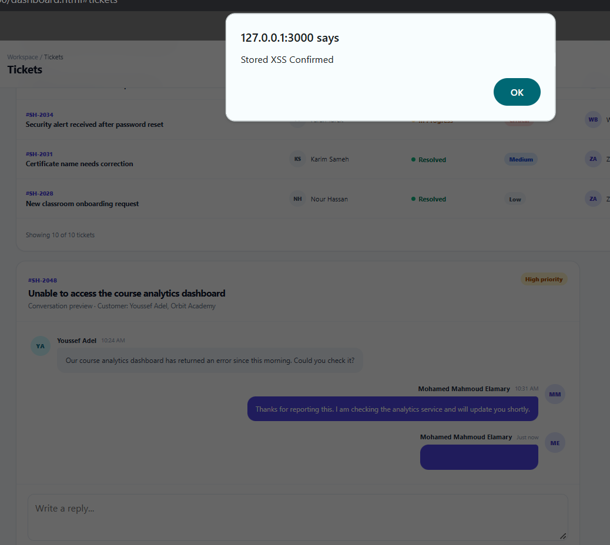

# Stored Cross-Site Scripting (XSS) Vulnerability

## Vulnerability Summary

| Field | Details |
|---|---|
| Application | SupportHub — Vulnerable Edition |
| Vulnerability | Stored Cross-Site Scripting (Stored XSS) |
| Severity | High |
| CWE | CWE-79 |
| Affected Feature | Support Ticket Comments |
| Affected Ticket | `#SH-2048` |
| Affected Endpoints | `POST /api/tickets/2048/comments` and `GET /api/tickets/2048/comments` |
| Authentication Required | Yes |
| Testing Environment | Authorized local training environment |

## Description

The SupportHub ticket conversation feature allows authenticated support agents to add comments to ticket `#SH-2048`.

The application stores the submitted comment in the database without sanitizing potentially dangerous HTML. The front end later inserts the stored comment into the page using `innerHTML` and `insertAdjacentHTML()` without output encoding.

As a result, an attacker can store HTML containing JavaScript event handlers. The browser executes the injected JavaScript whenever the affected ticket conversation is displayed.

Because the payload remains in the database and executes again after the page is refreshed, this vulnerability is classified as Stored XSS.

## Affected Endpoints

```text
POST /api/tickets/2048/comments
GET /api/tickets/2048/comments
```

## Affected Files

```text
src/routes/ticket.routes.js
public/js/app.js
public/dashboard.html
```

## Preconditions

- SupportHub is running locally.
- The tester is signed in to a valid demonstration account.
- The test is performed only in the authorized local training environment.
- Only a harmless JavaScript demonstration payload is used.

## Normal Functionality Test

1. Start SupportHub:

   ```powershell
   npm run dev
   ```

2. Open:

   ```text
   http://127.0.0.1:3000
   ```

3. Sign in using a demonstration account.

4. Open `Tickets` from the sidebar.

5. Locate the conversation for ticket:

   ```text
   #SH-2048
   ```

6. Enter a normal comment:

   ```text
   This is a normal support reply.
   ```

7. Click:

   ```text
   Send reply
   ```

8. Confirm that the comment appears in the conversation.

## Stored XSS Test

Enter the following harmless proof-of-concept payload into the reply field:

```html

```

Click:

```text
Send reply
```

## Observed Result

The browser attempts to load the invalid image. When the image fails to load, the injected `onerror` JavaScript handler executes and displays an alert containing:

```text
XSS_CONFIRMED
```

This confirms that user-controlled HTML and JavaScript are interpreted by the browser instead of being displayed as plain text.

## Persistence Test

1. Close the alert.
2. Refresh the SupportHub page.
3. Return to the `Tickets` page.
4. Display the conversation for ticket `#SH-2048`.

## Observed Persistence Result

The JavaScript alert appears again after the page is refreshed.

The payload executes again because:

1. The server stored the original comment in the SQLite database.
2. The browser retrieved the stored comment through the comments API.
3. The front end inserted the comment into the page as HTML.

This confirms that the vulnerability is Stored XSS rather than a temporary client-side rendering issue.

## Network Evidence

The browser submits a request similar to:

```http
POST /api/tickets/2048/comments
Content-Type: application/json
```

Request body:

```json
{
  "body": ""
}
```

The response contains the unsanitized comment:

```json
{
  "message": "Reply added.",
  "comment": {
    "id": 1,
    "author": "Authenticated User",
    "role": "staff",
    "body": "",
    "createdAt": "Just now"
  }
}
```

When the comments are requested again, the stored payload remains present in the API response:

```http
GET /api/tickets/2048/comments
```

Example response:

```json
{
  "comments": [
    {
      "author": "Authenticated User",
      "role": "staff",
      "body": "",
      "createdAt": "Just now"
    }
  ]
}
```

## Expected Secure Behavior

The application should display the submitted value as plain text:

```text

```

The browser must not create an image element or execute the `onerror` handler.

If rich HTML comments are not required, all comment content should be output encoded.

If limited rich text is required, the application should sanitize the submitted HTML using a maintained allowlist-based HTML sanitizer.

## Vulnerable Back-End Code

The affected endpoint is located in:

```text
src/routes/ticket.routes.js
```

The server accepts the comment from the request body:

```js
const body = String(req.body.body || '');

if (!body.trim()) {
  return res.status(400).json({
    error: 'Comment cannot be empty.'
  });
}
```

The comment is stored exactly as submitted:

```js
const result = db.prepare(`
  INSERT INTO comments
    (
      ticket_id,
      user_id,
      customer_id,
      author_name,
      author_role,
      body,
      created_label
    )
  VALUES (?, ?, NULL, ?, 'staff', ?, 'Just now')
`).run(
  req.params.ticketId,
  req.session.user.id,
  req.session.user.name,
  body
);
```

Parameterized database queries protect this operation from SQL Injection, but they do not protect the browser from XSS. The stored comment still requires safe output handling.

## Vulnerable Immediate Rendering

After a new comment is submitted, the front end inserts the response into the page using `insertAdjacentHTML()`:

```js
document.querySelector('#conversation').insertAdjacentHTML(
  'beforeend',
  `
    <div class="message staff">
      <span class="avatar avatar-indigo">
        ${escapeHtml(currentUser.initials)}
      </span>
      <div>
        <div class="message-meta">
          <strong>${escapeHtml(currentUser.name)}</strong>
          <small>Just now</small>
        </div>
        <div class="message-bubble">
          ${data.comment.body}
        </div>
      </div>
    </div>
  `
);
```

The user's name and initials are encoded using `escapeHtml()`, but `data.comment.body` is inserted without encoding.

## Vulnerable Stored-Comment Rendering

When the page loads, stored comments are retrieved and inserted using `innerHTML`:

```js
document.querySelector('#conversation').innerHTML =
  data.comments.map((comment) => `
    <div class="message ${comment.role === 'staff' ? 'staff' : ''}">
      <span class="avatar">
        ${getInitials(comment.author)}
      </span>
      <div>
        <div class="message-meta">
          <strong>${escapeHtml(comment.author)}</strong>
          <small>${escapeHtml(comment.createdAt)}</small>
        </div>
        <div class="message-bubble">
          ${comment.body}
        </div>
      </div>
    </div>
  `).join('');
```

Because `comment.body` is not encoded or sanitized, stored HTML is interpreted by the browser.

## Root Cause

The vulnerability exists because the application:

1. Accepts HTML content from an untrusted user.
2. Stores the content without sanitization.
3. Returns the original content through the API.
4. Inserts the content using `innerHTML` and `insertAdjacentHTML()`.
5. Does not apply context-appropriate output encoding.
6. Does not use a strict HTML allowlist.
7. Does not enforce a restrictive Content Security Policy as an additional defense.

## Security Impact

An attacker who successfully exploits this vulnerability may be able to:

- Execute JavaScript in another user's browser.
- Perform actions using the victim's authenticated session.
- Read sensitive information displayed on the page.
- Modify the appearance or content of support tickets.
- Display fraudulent forms or phishing messages.
- Redirect users to malicious pages.
- Send unauthorized requests from the victim's browser.
- Target multiple users who view the stored comment.

The session cookie is configured with `HttpOnly`, which helps prevent direct JavaScript access to the cookie. However, it does not prevent injected JavaScript from performing authenticated actions through the victim's browser.

## Evidence

### XSS Payload Submitted



### JavaScript Alert Executed


### Payload Returned by the API


### Payload Executed After Refresh


## Recommended Remediation

The secured edition should:

1. Treat ticket comments as plain text unless rich HTML is explicitly required.
2. Replace unsafe `innerHTML` usage with `textContent`.
3. Avoid inserting untrusted data through `insertAdjacentHTML()`.
4. Create DOM elements safely and assign user content through `textContent`.
5. Apply context-appropriate output encoding.
6. Sanitize HTML using a maintained allowlist-based sanitizer if rich text is required.
7. Validate content on the server as an additional defense.
8. Apply a restrictive Content Security Policy.
9. Keep the session cookie protected with `HttpOnly`.
10. Test both newly submitted and previously stored comments after remediation.

## Safer Rendering Example

For plain-text comments, the application should create the element and assign the comment using `textContent`:

```js
const messageBubble = document.createElement('div');

messageBubble.className = 'message-bubble';
messageBubble.textContent = data.comment.body;
```

For the stored-comment list, the application should avoid building a complete HTML string containing untrusted values.

Encoding must occur at the output location. Relying only on input validation is not sufficient.

## Verification Criteria for the Secured Edition

The vulnerability will be considered fixed when:

- Normal text comments still appear correctly.
- HTML tags are displayed as text rather than interpreted.
- The `onerror` handler does not execute.
- No alert appears after submitting the test payload.
- No alert appears after refreshing the page.
- Stored comments are rendered using safe DOM operations.
- Direct API requests cannot bypass the protection.
- A restrictive Content Security Policy provides additional protection.

## Conclusion

The Stored XSS vulnerability was successfully reproduced in the SupportHub vulnerable edition.

The application stored a user-controlled HTML payload and inserted it into the ticket conversation without output encoding or sanitization. The injected JavaScript executed immediately and executed again after the page was refreshed, confirming persistent Stored XSS.